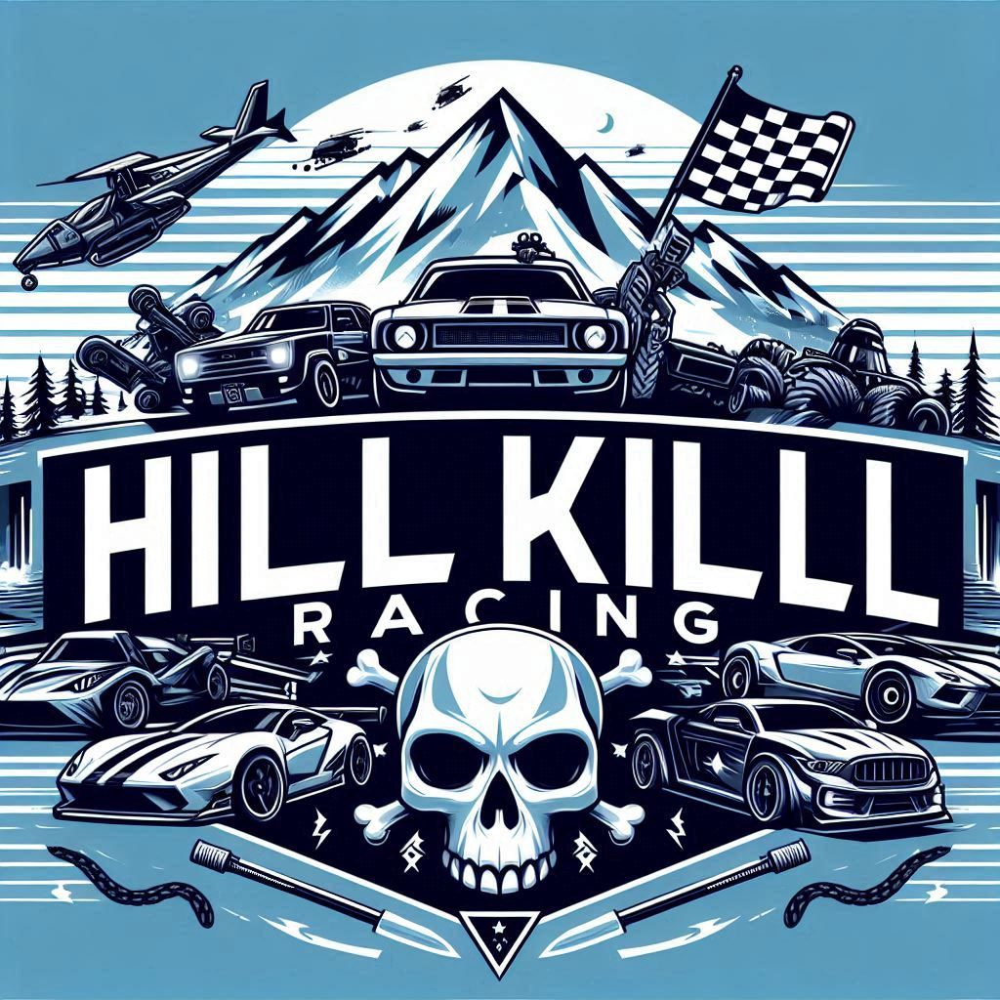

# HillKillRacing - Mod Menu pour Hill Climb Racing 🚗💨

**Version :** 1.0.0  
**Développeur :** OufRob89 & PetitOursBr1

## Introduction

Bienvenue dans **HillKillRacing** 🎮, un mod menu personnalisé conçu pour améliorer ton expérience dans *Hill Climb Racing*.

## Fonctionnalités

- **💰 Pièces Illimitées** : Ne te soucie plus jamais de manquer de monnaie !
- **💎 Gemmes Illimitées** : Ne te soucie plus jamais de manquer de monnaie !
- **🚗 Tous les véhicules débloqués** : Accès instantané à tous les véhicules sans avoir besoin de faire des heures de jeu.
- **🛣️ Tous les circuits débloqués** : Découvre tous les circuits disponibles dès le début.
- **🦸‍♂️ Mode Invincible** : Plus jamais d'accidents, même avec les cascades les plus folles !
- **⛽ Essence Infinie** : Ajuste la gravité pour des expériences de jeu totalement inédites.
- **🏎️ Boost de Vitesse** : Traverse les niveaux à toute allure avec un boost de vitesse personnalisable.
- **🌍 Modificateur de Gravité** : Ajuste la gravité pour des expériences de jeu totalement inédites.
- **🚫 Pas de Publicités** : Profite d'une expérience sans interruption avec zéro pub.

## Installation

1. **Télécharge** la dernière version de HillKillRacing depuis [ce lien](#).
2. **Lance** le jeu et profite du mod menu externe !

> **Note :** Assure-toi de désactiver les mises à jour automatiques de Hill Climb Racing pour éviter que le mod ne fonctionne plus.

## Instructions d'utilisation

- **Accéder au Mod Menu** : En jeu, appuie sur l'icône flottante en haut à droite pour ouvrir le menu HillKillRacing 🛠️.
- **Activer/Désactiver les Mods** : Active ou désactive les fonctionnalités à ta guise pendant la partie.
- **Personnalisation** : Certaines fonctionnalités comme le boost de vitesse ou le modificateur de gravité peuvent être ajustées via les curseurs du menu.

## Compatibilité

- **Plateformes supportées :** Windows 📱
- **Version du jeu supportée :** Toutes les versions de HillClimbRacing
- **Root requis :** Non ❌

## Problèmes et Support

Si tu rencontres des bugs ou des problèmes, n'hésite pas à les signaler sur notre page [GitHub Issues](#). Nous acceptons également toutes suggestions pour ajouter de nouvelles fonctionnalités ou améliorer le mod ! 💡

## Avertissement ⚠️

Ce mod est destiné à un usage personnel uniquement. Le développeur n'est pas responsable des bannissements, pertes de données ou autres problèmes pouvant survenir à la suite de l'utilisation de ce mod. Utilise les mods à tes propres risques.

---

Profite de la nouvelle expérience de jeu, et merci d'utiliser HillKillRacing ! 🎉
